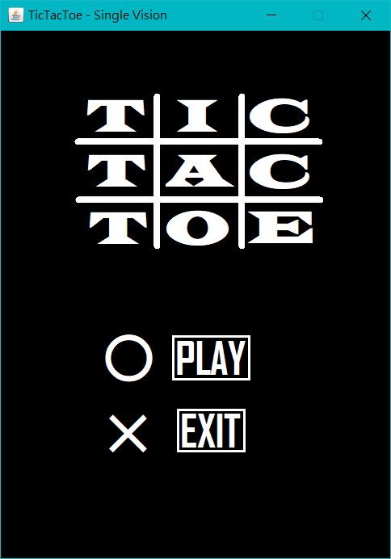
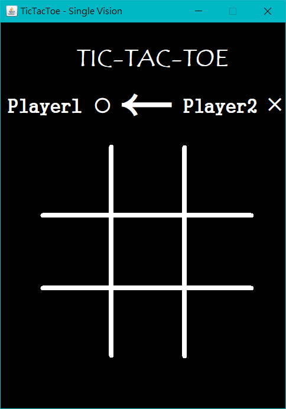
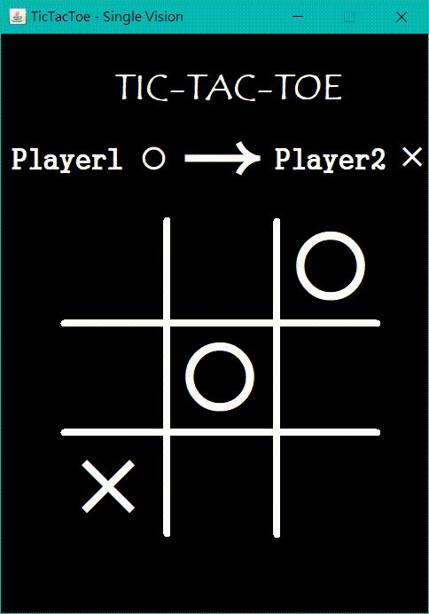
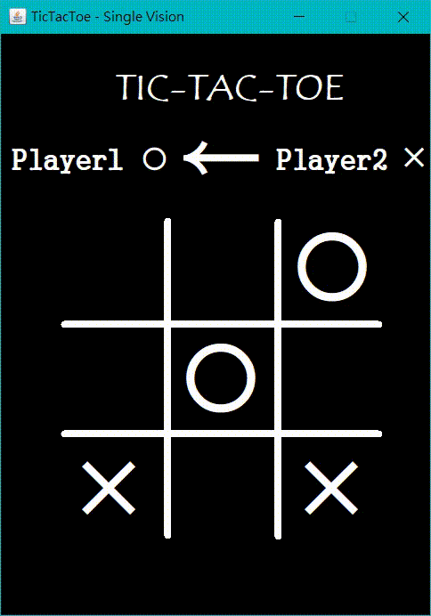
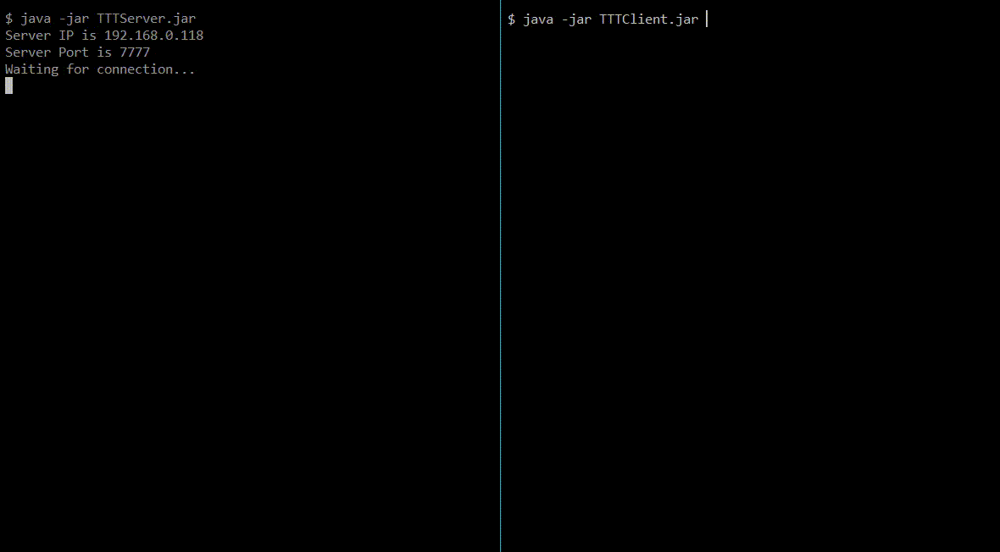
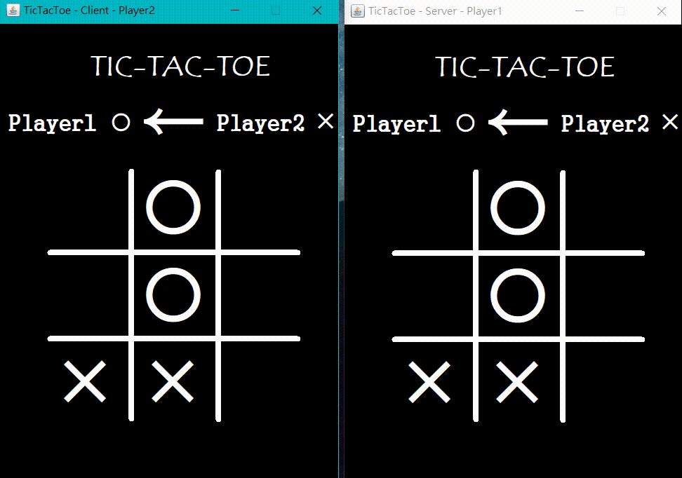

# Tic-Tac-Toe

A Tic-Tac-Toe game implemented with Java (single machine version and online socket version)

## Screenshots
Single Machine Version
| Menu | Board | Win | Even |
| --- | --- | --- | --- |
|  |  |  |  |

Online Socket Version
| Connect | Play |
| --- | --- |
|  |  |
